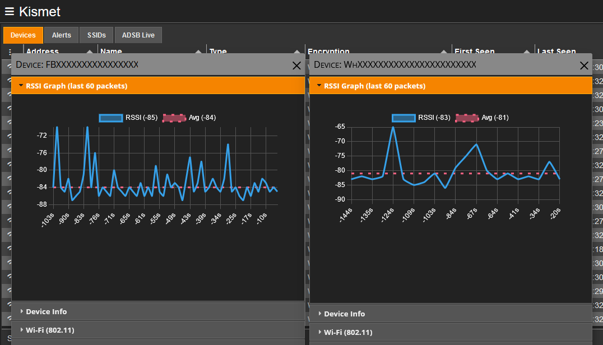

# plugin-kismet-rssi-graph

Initial idea was thought of back a couple of years ago to assist completing a [DEF CON RF Village CTF foxhunt challenge](https://github.com/rfhs/rfhs-wiki/wiki/RF-CTF-Foxhunt), but I was recently inspired to complete the plugin when the [Rizzyscope](https://github.com/GobiasSomeCoffeeCo/rizzyscope) project added a similar feature!

Documentation and quality of life features coming soon (e.g., settings, custom colors, etc.).
